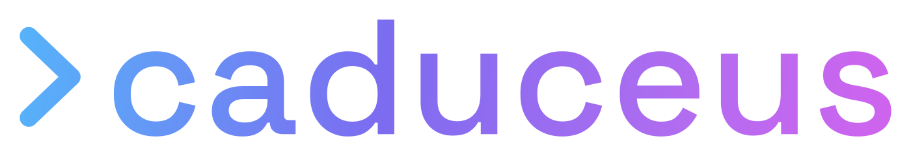

**A local-first gateway hub + CLI + Web UI for orchestrating sandboxed [hermes](https://hermes-agent.nousresearch.com/) agents.**

  
  
  

---

Caduceus runs AI agents in isolated **Docker containers** backend, routes their LLM traffic through a single OpenAI-compatible gateway
 you control, and gives you a CLI **and** a small web UI to provision, watch, and chat with them — with streaming
responses, thinking, and tool-call display.

- 🔀 **Central AI-Gateway** — agents route their LLM calls through Caduceus to a configurable, OpenAI-compatible upstream (e.g. a local [Ollama](https://ollama.com/) at `http://localhost:11434/v1`, llama.cpp, LM Studio, vLLM, or a hosted API).
- 💬 **Streaming chat** — talk to any agent with session-persistent, streaming responses; see **thinking** and **tool calls** as they happen.
- 🖥️ **Web UI** — a dependency-free dashboard to see status, add agents (with live provisioning progress), and chat — served loopback-only.
- 🛠️ **Per-agent config** — edit a local agent's skills, tools, and persona ("soul").

> **Status:** alpha / under active development. Interfaces may change.

---

## License

This project is licensed under the **MIT License** — see [LICENSE](LICENSE) for details.

## Acknowledgements

- [hermes](https://hermes-agent.nousresearch.com/) — the agent runtime Caduceus orchestrates.