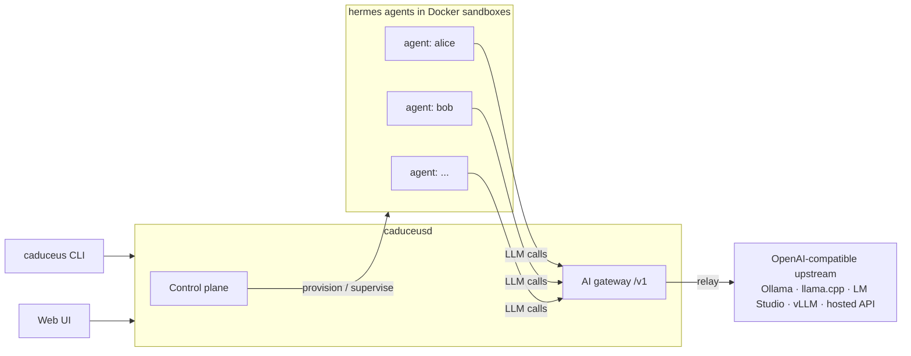

<div align="center">


**One control plane for all your [hermes](https://hermes-agent.nousresearch.com/) agents — provision, observe, and chat through a single gateway.**

<p>
  
  
  
</p>

</div>

---

Standing up an AI agent is a checklist: a config to wire, credentials to mint, a sandbox to start, an endpoint to point it at, a health check to pass. Running a whole fleet means repeating that checklist for every agent — and then keeping every copy alive, consistent, and pointed at the right model by hand. **Caduceus** is the operations layer that makes the checklist disappear: one command provisions a [hermes](https://hermes-agent.nousresearch.com/) agent end-to-end into an isolated Docker sandbox, a daemon keeps supervising it afterward, every agent's LLM traffic flows through one central gateway you control, and a single CLI and web dashboard let you watch and talk to all of them from one place.

## Features

- 🧭 **One-command provisioning** — `caduceus agent create` runs the whole pipeline (workspace, sandbox container, credentials, model routing, health check) as a trackable job with step-by-step progress. Tearing down is just as clean.
- 🛰️ **A daemon that keeps watching** — agents aren't just created, they're *operated*: the daemon health-probes the fleet, and a reconciler compares what's actually running against what should be, surfacing anything that drifted or was left behind.
- 🔀 **Central AI gateway** — all agents call LLMs through Caduceus, which relays to a single OpenAI-compatible upstream ([Ollama](https://ollama.com/), llama.cpp, LM Studio, vLLM, or a hosted API). Swap the upstream once and the entire fleet follows — no per-agent reconfiguration, no drift.
- 🔑 **Credential isolation** — agents never see your upstream API key. Each agent authenticates to the gateway with its own rotatable token; the real key lives only in the gateway. Cross-fleet traffic is metered per agent, so you always know who's calling what.
- 💬 **Streaming chat** — talk to any agent from the terminal or the browser, with persistent sessions and live rendering of **thinking** and **tool calls**.
- 🖥️ **Web UI** — a dashboard served by the daemon itself (loopback-only, token-gated): fleet status, live provisioning progress, gateway traffic, and chat.
- 🎭 **Per-agent identity & policy** — edit each agent's persona (`SOUL.md`), toggle skills and toolsets, set approvals mode, and cap CPU / memory / disk / network per agent.
- 🩺 **Self-diagnosis** — `caduceus doctor` checks hermes, Docker, the daemon, the upstream, and the registry in one shot.

> **Status:** alpha / under active development. Interfaces may change.

## How it works

Caduceus is a single daemon (`caduceusd`) with two planes:

- **Control plane** — provisions and supervises agents. It drives the hermes CLI and Docker for you: creating a profile, wiring its config, minting a gateway token, starting the sandbox container, and health-checking the result. Provisioning runs as trackable jobs with step-by-step progress, and a reconciler surfaces any orphaned resources.
- **Gateway (data plane)** — an OpenAI-compatible `/v1` endpoint every agent is configured to use. Each request is authenticated with the agent's own token, relayed to your upstream, and measured (status, latency, per-agent traffic). Request/response bodies are forwarded untouched and never stored.



Because every agent speaks to the model *through* Caduceus, the gateway is the one place where you change the model endpoint, hold the credentials, and watch the traffic — no matter how many agents you run.

## Requirements

- **Python** 3.11+
- **Docker** — agent sandboxes run as containers
- **[hermes](https://hermes-agent.nousresearch.com/)** CLI installed and on `PATH`
- An **OpenAI-compatible LLM endpoint** — local (Ollama, llama.cpp, LM Studio, vLLM) or hosted

## Installation

Install from source (PyPI release planned):

```bash
git clone https://github.com/baleian/caduceus.git
cd caduceus
uv tool install .        # or: pipx install .  /  pip install .
```

This installs two commands: `caduceus` (the CLI) and `caduceusd` (the daemon, normally managed for you via `caduceus serve`).

## Quick start

```bash
# 1. One-time setup: creates ~/.caduceus, mints the admin token,
#    and asks for your upstream endpoint + default model
caduceus init

# 2. Start the daemon (127.0.0.1:4285 by default)
caduceus serve -d

# 3. Verify everything is wired up
caduceus doctor

# 4. Provision your first agent (profile + sandbox + gateway token)
caduceus agent create alice

# 5. Talk to it
caduceus chat alice
```

Then open the dashboard:

```bash
caduceus ui
```

## Usage

### Managing agents

```bash
caduceus agent create bob --cpu 2 --memory 2048 --network none --persona persona.md
caduceus agent ls                  # fleet overview (--probe for live container state)
caduceus agent status bob
caduceus agent logs bob -f         # follow agent logs
caduceus agent stop bob
caduceus agent start bob
caduceus agent rm bob --yes        # removes the agent; its workspace is preserved
```

Provisioning runs asynchronously as a job — add `--no-wait` to get a job id back immediately, then track it with `caduceus job ls`, `caduceus job status <id>`, or `caduceus job wait <id>`.

### Shaping an agent

```bash
caduceus agent soul alice --edit                 # edit persona (SOUL.md) in $EDITOR
caduceus agent skills alice                      # list skills
caduceus agent skills alice --disable browser    # toggle a skill
caduceus agent toolsets alice --set tools.json   # replace platform toolsets
caduceus agent approvals alice --set smart       # off (default) | smart | manual
caduceus agent token rotate alice                # rotate its gateway credential
```

### The gateway

```bash
caduceus gateway status            # upstream health + per-agent traffic
caduceus gateway upstream get
caduceus gateway upstream set http://localhost:11434/v1 \
    --default-model qwen3:14b \
    --api-key-env MY_UPSTREAM_KEY
```

`upstream set` hot-swaps the endpoint for the whole fleet — in-flight requests drain on the old upstream while new ones go to the new one. The API key is referenced by environment-variable *name*, so the secret itself never lands in a config file.

### Chat

```bash
caduceus chat alice                # resumes the latest session
caduceus chat alice --new          # start a fresh session
caduceus chat alice --session <id> # resume a specific one
```

Streaming responses render thinking and tool calls live; `Ctrl+C` stops the current turn without killing the session.

### Web UI

`caduceus ui` opens the dashboard in your browser with the admin token passed in the URL fragment (fragments are never sent over HTTP, so the token stays out of server and proxy logs). The UI covers the same ground as the CLI: fleet status, agent creation with live progress, gateway traffic, and streaming chat.

### Scripting

Most read commands accept `--json` for machine-readable output, and the CLI uses meaningful exit codes — suitable for cron jobs and shell pipelines.

## Configuration

Everything lives under `~/.caduceus` (override with `--home` or `CADUCEUS_HOME`):

| Path | Purpose |
|---|---|
| `config.yaml` | daemon listen address, upstream endpoint & default model |
| `admin.token` | admin credential for the control API / web UI |
| `registry.json` | the record of managed agents |
| `workspaces/` | per-agent working directories (survive agent removal) |

The daemon binds to `127.0.0.1:4285` by default; pass `--host`/`--port` to `caduceus serve` or set them in `config.yaml`.

## License

This project is licensed under the **MIT License** — see [LICENSE](LICENSE) for details.

## Acknowledgements

- [hermes](https://hermes-agent.nousresearch.com/) — the agent runtime Caduceus orchestrates.
