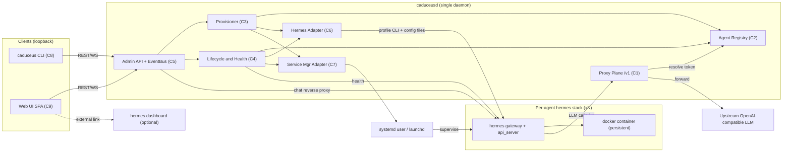

# Caduceus — Component Dependencies & Data Flow

## 의존성 매트릭스 (행 → 열 방향 의존)

| ↓사용자 \ 피사용→ | C1 Proxy | C2 Registry | C3 Prov | C4 Life | C5 Admin | C6 Hermes | C7 SvcMgr | hermes api_server | upstream LLM |
|---|---|---|---|---|---|---|---|---|---|
| C1 Proxy Plane | — | R(토큰) | | | | | | | HTTP |
| C2 Registry | | — | | | | | | | |
| C3 Provisioner | | RW | — | | | 호출 | 호출 | health probe | |
| C4 Lifecycle | | R | | — | | 호출 | 호출 | health/stop | |
| C5 Admin API | 리로드 | R | 호출 | 호출 | — | 호출(soul 등) | | 리버스 프록시 | |
| C8 CLI | | | | | HTTP/WS | | | | |
| C9 Web UI | | | | | HTTP/WS | | | | |
| hermes(에이전트) | HTTP(/v1) | | | | | | | | |

**규칙**: hermes 접점은 C6, OS 서비스 접점은 C7로만 수렴 (경계 컴포넌트). C1은 C2 읽기 외 제어 평면 의존 없음 (데이터 평면 독립성).

## 통신 패턴

- CLI/Web UI ↔ caduceusd: REST + WebSocket(이벤트), loopback
- caduceusd ↔ hermes api_server: HTTP (health, 리버스 프록시), loopback, per-agent 포트
- hermes 에이전트 → caduceusd `/v1`: OpenAI wire, Bearer per-agent 토큰
- caduceusd → 업스트림 LLM: OpenAI wire (사용자 제공 endpoint)
- caduceusd → hermes: subprocess(CLI) + 파일(config.yaml/.env/SOUL.md) — C6 한정
- caduceusd → OS: systemctl --user / launchctl — C7 한정

## 데이터 플로우 다이어그램

### Mermaid



### Text Alternative

```
[CLI (C8)] --REST/WS--> [Admin API (C5)] <--REST/WS-- [Web UI (C9)]
[Admin API] --> [Provisioner (C3)] --> [Registry (C2)]
[Admin API] --> [Lifecycle (C4)]   --> [Registry (C2)]
[Provisioner/Lifecycle] --> [Hermes Adapter (C6)] --(subprocess+files)--> hermes profile/gateway
[Provisioner/Lifecycle] --> [Service Mgr (C7)] --> systemd user / launchd --supervise--> hermes gateways
[Admin API] --chat reverse proxy--> hermes api_server (per-agent port)
[Lifecycle] --health probe--> hermes api_server
hermes agent --LLM /v1 (Bearer agent token)--> [Proxy Plane (C1)] --resolve_token--> [Registry (C2)]
[Proxy Plane] --forward (SSE pass-through)--> Upstream OpenAI-compatible LLM
hermes gateway --> docker container (persistent, per-profile labels)
Web UI -.external link.-> hermes dashboard (optional)
```

## 결합도 관리

- **금지 의존**: C1→C3/C4/C6/C7 (프록시는 제어 로직 무지), C9→hermes 직접 (항상 C5 경유), C3/C4→hermes 직접 셸아웃 (C6 경유)
- **이벤트 결합**: 상태 전이는 전부 EventBus 경유 — UI/CLI는 폴링 불필요
- **버전 결합**: hermes CLI/config 스키마 의존은 C6 한 곳 → hermes 업그레이드 영향면 최소화 + preflight에서 버전 확인
