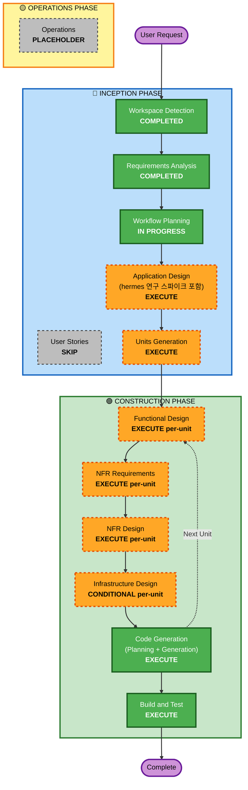

# Execution Plan — Caduceus

**Date**: 2026-07-02
**Based on**: requirements.md v1.0 (approved)

## Detailed Analysis Summary

### Change Impact Assessment
- **User-facing changes**: Yes — CLI(F10)와 로컬 Web UI(F11)가 신규 제공됨 (단일 페르소나: 로컬 운영자)
- **Structural changes**: Yes — 신규 시스템 전체 (오케스트레이션/컨트롤 계층, 중앙 게이트웨이, CLI, Web UI)
- **Data model changes**: Yes — 에이전트 레지스트리/설정, 게이트웨이 토큰·라우팅 설정, 세션 참조 등 로컬 영속 상태 신설
- **API changes**: Yes — 자체 구현 게이트웨이의 OpenAI 호환 엔드포인트(F4) + 컨트롤 표면(loopback) 신설
- **NFR impact**: Yes — 격리·보안(N3), 신뢰성(N4), 관측성(N5), 패키징(N8), 플랫폼(N9) 전반

### Risk Assessment
- **Risk Level**: High — hermes 네이티브 기능의 실제 동작·한계에 대한 미지수가 다수 (D-a~D-d가 이에 의존). 프로덕션 시스템 영향은 없으나(그린필드) 설계 불확실성이 높음
- **Rollback Complexity**: Easy — 그린필드, git 기반, 버전 고정 롤백(R8)
- **Testing Complexity**: Complex — Docker 격리 검증, 스트리밍 대화, 게이트웨이 프록시, 멀티 플랫폼(N9), PBT 전체 강제

### 특기 사항 — 설계 착수 전제 (미션 §5, requirements §7.1)
Application Design의 **첫 단계는 hermes 학습(연구 스파이크)** 이다: 공식 문서·소스로 profiles / terminal backends / gateway·api_server / tool 실행 위치 / 모델 라우팅 / 네트워킹 / dashboard·approvals의 네이티브 동작과 한계를 파악하고 조사 결과를 문서화한다. 이 결과가 D-a~D-e 결정과 R1 후보 검증의 근거가 된다.

## Workflow Visualization

### Mermaid Diagram



### Text Alternative

```
INCEPTION PHASE
- Workspace Detection ........ COMPLETED
- Reverse Engineering ........ N/A (greenfield)
- Requirements Analysis ...... COMPLETED (v1.0 approved)
- User Stories ............... SKIP
- Workflow Planning .......... IN PROGRESS (this document)
- Application Design ......... EXECUTE (first step: hermes research spike)
- Units Generation ........... EXECUTE

CONSTRUCTION PHASE (per-unit loop)
- Functional Design .......... EXECUTE per-unit (PBT-01 property identification)
- NFR Requirements ........... EXECUTE per-unit (tech stack, PBT-09 framework)
- NFR Design ................. EXECUTE per-unit
- Infrastructure Design ...... CONDITIONAL per-unit (runtime/provisioning unit likely)
- Code Generation ............ EXECUTE per-unit (ALWAYS)
- Build and Test ............. EXECUTE (ALWAYS)

OPERATIONS PHASE
- Operations ................. PLACEHOLDER
```

## Phases to Execute

### 🔵 INCEPTION PHASE
- [x] Workspace Detection (COMPLETED)
- [x] Requirements Analysis (COMPLETED — v1.0 approved)
- [x] User Stories (SKIPPED)
  - **Rationale**: 단일 페르소나(로컬 운영자) 개발자 도구. F1–F11이 이미 검증 가능한 수준으로 열거되어 스토리의 추가 가치 낮음. 승인된 요구사항 완료 메시지에서 생략 권장 제시 후 사용자 승인
- [x] Workflow Planning (IN PROGRESS — this document)
- [ ] Application Design — **EXECUTE**
  - **Rationale**: 신규 컴포넌트 다수(게이트웨이, 컨트롤 계층, CLI, Web UI)와 그 경계·의존성 정의 필요. **첫 단계로 hermes 연구 스파이크 수행**(요구사항 §7.1) 후 D-a~D-d 결정 및 R1 후보 검증. P1–P4 준수 근거(hermes 네이티브 경로 소진 증빙)를 여기서 문서화
- [ ] Units Generation — **EXECUTE**
  - **Rationale**: 복잡한 시스템의 구조적 분해 필요 (예상 후보: gateway / orchestration·provisioning / CLI / Web UI — 확정은 Application Design 이후)

### 🟢 CONSTRUCTION PHASE (per-unit loop)
- [ ] Functional Design — **EXECUTE (per-unit)**
  - **Rationale**: 게이트웨이 라우팅·인증, 라이프사이클 상태 전이 등 신규 비즈니스 로직. PBT-01(속성 식별)이 이 단계를 요구 (blocking)
- [ ] NFR Requirements — **EXECUTE (per-unit)**
  - **Rationale**: 기술 스택 미정(D-e), 보안(N3)·신뢰성(N4)·플랫폼(N9) 고려 필요. PBT-09(프레임워크 선정)가 이 단계를 요구
- [ ] NFR Design — **EXECUTE (per-unit)**
  - **Rationale**: NFR Requirements 실행에 따름. 타임아웃/서킷브레이커(RESILIENCY-10), 보안 헤더(SECURITY-04), 로깅(SECURITY-03) 등 패턴 반영
- [ ] Infrastructure Design — **CONDITIONAL (per-unit)**
  - **Rationale**: 클라우드 리소스 없음. 단, 격리 런타임(Docker) 토폴로지·네트워킹(D-a)·CI/CD(R7)가 인프라 성격을 가지므로 해당 유닛(런타임/프로비저닝)에서만 실행하고 나머지 유닛은 스킵. 유닛별 판정은 Units Generation 후 확정
- [ ] Code Generation — **EXECUTE (ALWAYS, per-unit)**
  - **Rationale**: Part 1 Planning + Part 2 Generation. PBT 테스트 포함 (PBT-02~08, 10)
- [ ] Build and Test — **EXECUTE (ALWAYS)**
  - **Rationale**: 빌드/단위/통합(격리 검증 F3, 게이트웨이 경유 F4, 스트리밍 F6)/PBT(시드 로깅, PBT-08) 지침 생성. CI/CD 파이프라인 정의(R7) 반영

### 🟡 OPERATIONS PHASE
- [ ] Operations — PLACEHOLDER
  - **Rationale**: 향후 확장 영역. 경량 인시던트 대응·COE 프로세스(R10)와 트러블슈팅 런북은 Build and Test 산출물에 포함

## Estimated Timeline
- **Total Stages**: 9개 실행 (INCEPTION 잔여 2 + CONSTRUCTION 유닛별 루프 + Build and Test)
- **Estimated Duration**: 설계 세션 2–3회 (hermes 연구 스파이크 + Application Design + Units), 유닛당 구성 세션 1–2회. 총 작업 세션 약 8–14회 규모 (유닛 수 확정 후 갱신)

## Success Criteria
- **Primary Goal**: requirements.md §11의 성공 기준 1–9 충족
- **Key Deliverables**: 실행 가능한 Caduceus (CLI + Web UI + 자체 게이트웨이 + 격리 프로비저닝), hermes 연구 문서, 설계 문서(트레이드오프·커스텀 도입 사유 포함), 테스트 스위트(PBT 포함), CI/CD 파이프라인 정의, 설치/업그레이드/롤백 문서
- **Quality Gates**: 각 스테이지 승인 게이트 + Security/Resiliency/PBT 확장 규칙 컴플라이언스 (blocking)
